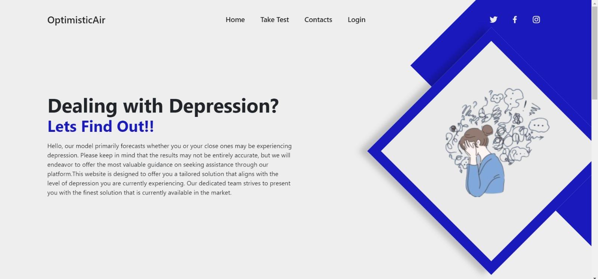
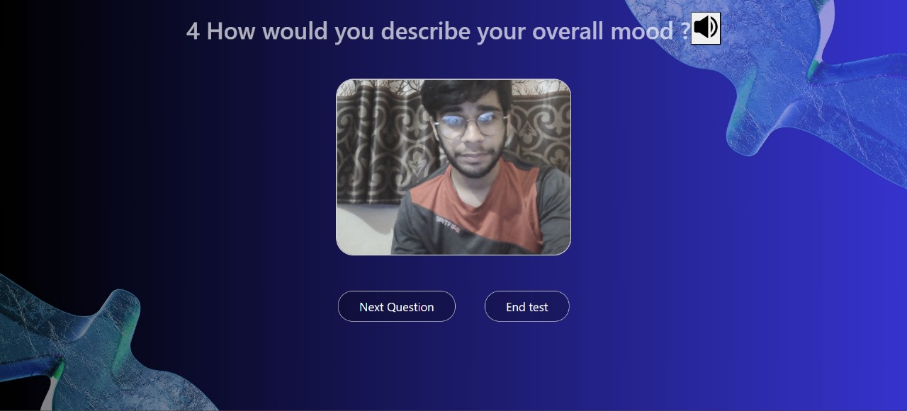
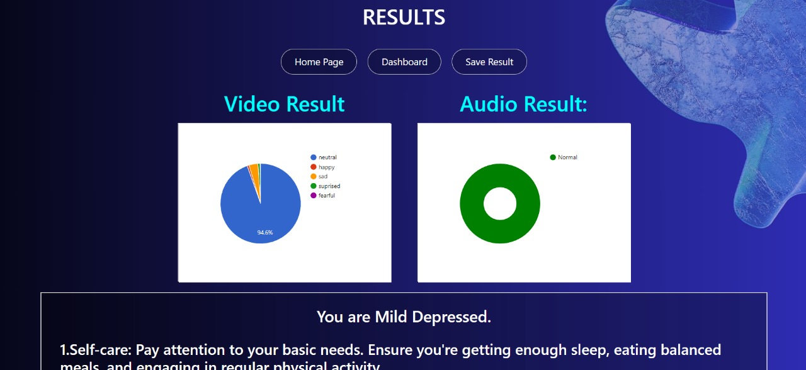
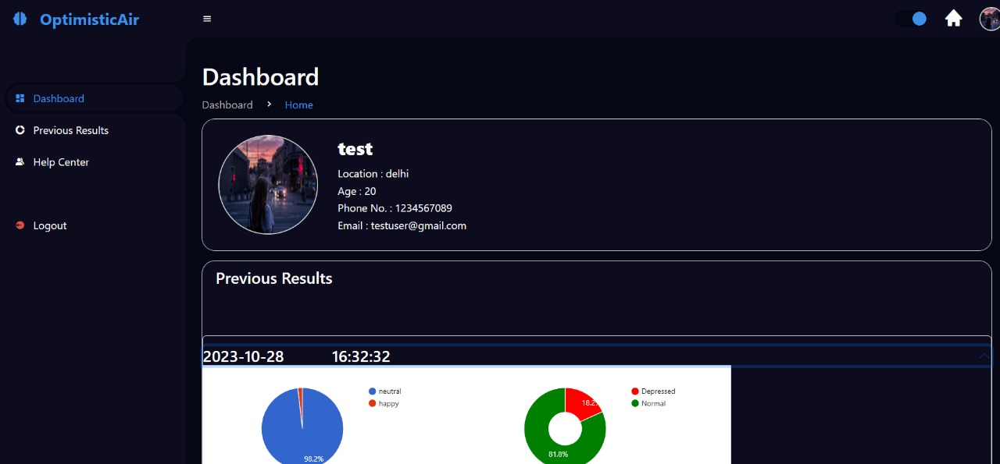

# Optimistic Air

Optimistic Air : "User-friendly site offering AV tests for depression, providing personalized suggestions based on your level."
https://optimistic-air.netlify.app/



## Table of Contents

- [Description](#description)
- [Features](#features)
- [Installation](#installation)
- [Dependencies](#dependencies)
- [Important Note](#Important_Note)

<!--  -->

## Description


We are currently addressing the issue of depression, a mental health disorder characterized by persistent feelings of sadness or disinterest in activities over extended periods. To assist individuals dealing with depression, we've developed a comprehensive model.

Depression is a subject that many people find difficult to discuss openly, making it challenging for individuals to recognize whether they might be experiencing it. Our model aims to bridge this gap by offering a depression assessment test. This test incorporates both audio and video data, enabling users to gauge their level of depression effectively.

When users take the test, our system analyzes their responses, paying particular attention to the words they use. Based on the vocabulary employed, the system can identify potential signs of depression. Additionally, the backend of our system, primarily built with JavaScript and React libraries, captures users' emotional expressions and facial cues as they interact with the test, further contributing to the assessment of their depression level.

The generated score not only reflects an individual's depression level but also incorporates AI-generated suggestions for managing and addressing depression. This innovative approach represents a significant step forward in identifying potential signs of depression and promoting awareness about mental health.

Our future scope includes achieving more accurate results through the utilization of AI technologies for video and audio processing and comparing previous results of the user and showing improvement of the user .

Our business model is the Pro Membership. With this subscription, users will gain access to a valuable feature: the ability to view their previous results in intricate detail and compare their progress over time.





## Features

- Audio Video test that will predict user is how much depressed
- User can its previos results in the dashboard .
- User can take the help of many consultants and doctors from our website

## Important_Note

1. Run this project on Chrome or Safari not on Brave .
2. For Login Email- testuser@gmail.com Password - testuser
   Besides this , you can also Register yourself

## Dependencies

We have used React js face api and react js speech to text recognition.

## Installation

For running te project locally on you device you have to do the folowing steps :

1. first clone the repository

```bash
$ git clone https://github.com/Aryan-Kohli/Syntax-error-x
```

2. for starting backend

```bash
$ cd api
$ npm i
$ npm start
```

3. for starting frontend

```bash
$ cd client
$ npm i
$ npm run dev
```

We have also Deployed our project
https://optimistic-air.netlify.app/

